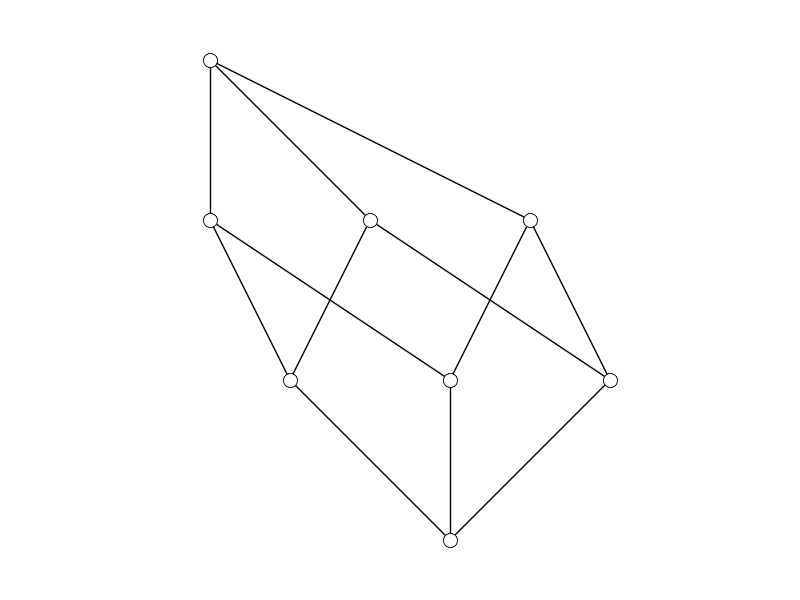

# Simple Poset Drawings

Julia module for drawing Hasse diagrams of partially ordered sets.

See also `SimpleGraphDrawings`.

## How to use

The `SimplePosetDrawings` module is used to draw pictures of
partially ordered sets. It relies on several packages from
my `SimpleWorld` collection. Here's the gist:

```julia
julia> using SimplePosets, SimplePosetDrawings, PyPlot

julia> P = Boolean(3)
SimplePoset{ASCIIString} (8 elements)

julia> X = SimplePosetDrawing(P)
Drawing of SimplePoset{ASCIIString} (8 elements)

julia> draw(X)
```
produces this:

[bool3-hasse.png]


## Acknowledgement

The code
in this module was developed by Connor Schembor.
